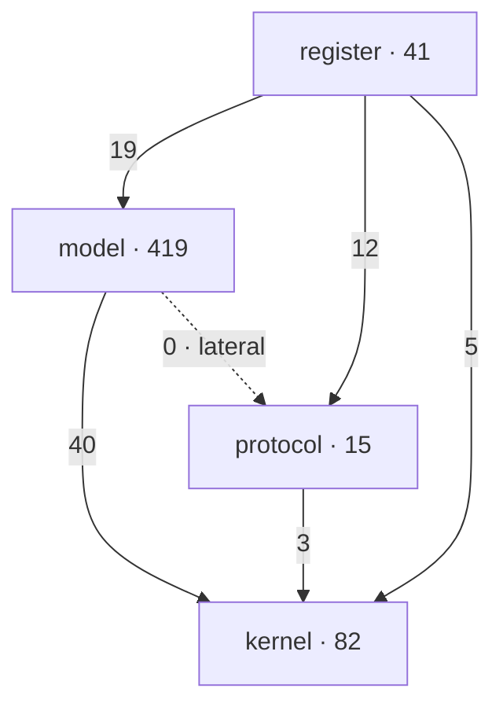
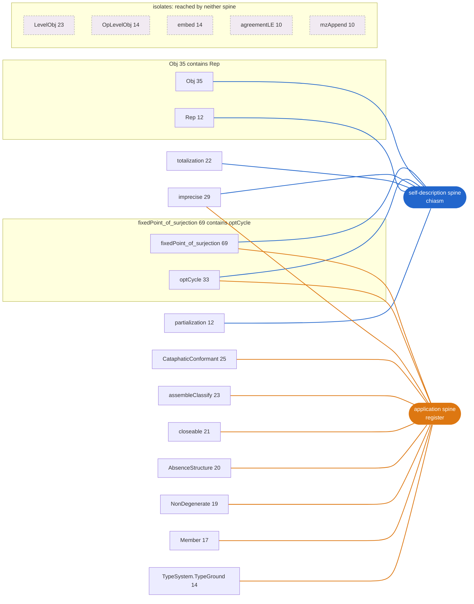

# Chiralogy

A small, machine-checked framework for **self-classification**: an object is a carrier `X`, a distinction
space `B`, and a map `c : X → X → B` by which the carrier classifies its own kind. It is **two-ended**
(chiral): the apophatic hole at the codomain and the cataphatic build at the domain, `op`-related but
non-superimposable. The framework is *autological*: an object of itself, subject to its own hole, forbidden
by its own boundary from claiming completeness.

The theorems are structural facts about the form `c : X → X → B`, universal in reach and verified in the
register of category theory, type theory, Lean, and English: a coordinate system, not a fence, and
re-verifiable in any adequate register. The only incompleteness is Chiralogy's account of itself, which by
its own central theorem has a hole in every register alike (see `INVARIANCE.md`).

## The object

An object is `(X, B, c)`; a morphism `(f, g)` preserves `c`. These form the category `Chiralogy`
(`Kernel/Apophatic.lean`). Everything else is structure of this category.

## Two absences

The kernel is two structural absences (`Kernel/Apophatic.lean`):

- **No reflexive object**: no `c : X → X → B` is surjective onto its own classifier space (the diagonal
  argument). This is the payload: no object has a complete self-account.
- **No universe classifier**, hence **no right adjoint** to the level shift (the size argument, via the
  paradox term). A right adjoint would produce a small copy of the universe.

They are distinct: the first is about a self-map's surjectivity, the second about a functor. The hole is
arity-1, transports across any distinction space carrying a fixed-point-free endomap, and is uniform -
present on every object and every mode (`Kernel/Apophatic.lean`).

## Derived versus imported

The kernel and its structure are **derived**. The apophatic **model** is the canonical extension: partiality,
the Kleisli category of `Maybe`, characterized by its universal property as the free adjunction of one absence
(`Model/Apophatic.lean`). The codomain axis closes there: stochastic and substructural distinction spaces
collapse through the diagonal in a cartesian base. The cataphatic **model** is the free skeleton
(`Model/Cataphatic.lean`): the free/forget moves over any ambient with a surplus, with borrowed fillings (a
field, a metric, an order, a magnitude) as instances.

The only **imported** data are the **target** (no standard certifies itself, so every target is defeasible)
and every **measure** or magnitude (degree, rate, count). Order is derived; rate and target are imported.

## The boundary

The framework hands back the ethics: no target, no valuation. It issues exactly one judgment without a
target (`Model/Boundary.lean`): the attempt to totalize a self-classification into completeness is
**self-defeating**: it aims at a destination the boundary proves empty, and reaches for it by trading a
true absence for a false verdict, a contradiction by its own goal. The prohibition follows from an
impossibility, not a value; it attaches only to the claim of completeness; and everything reachable (every
target, and whether any cost matters) is handed back.

## The chiralogy

Chiralogy is an object of itself. It is subject to its own hole; it cannot claim completeness; it falls under
its own boundary. That is the point: the framework is not exempt from the structure it describes.

## Structure

```
Kernel/     Apophatic (the hole, obstructions, modes, dynamics, self-application)
            Center (the empty center, the two ends of one map)
            Cataphatic (the free transpose)
Protocol/   Membership (the object condition and its payload)
Model/      Apophatic (Kl(Maybe), the none-chiasm)
            Boundary (the one prohibition, the seam, the one-way channel)
            Cataphatic (the free skeleton), Cataphatic/Instances (the borrowed fillings)
Registers/  the fork surface (a register is an object in a domain's language; physics is the first)
Experiments/archive/  the investigation record, not built
```

`Registers/` is the fork surface; physics is the first, and the rest is the formal silence past the boundary
until it arrives. See `GRADING.md` for the grades and the discipline.

Build: `lake exe cache get` then `lake build`. No `sorry`; every theorem's `#print axioms` is within
`{propext, Classical.choice, Quot.sound}`.

## Dependency graph

The declaration dependency graph is extracted from the built environment, never hand maintained.
`lake exe depgraph-proof` extracts the proof-level graph (edges from proof terms, the real structure)
to `graph/depgraph-proof.json`/`.dot` and renders **`graph/depgraph-proof.svg`, the self-image**: the
picture the structure was measured to be (see `graph/ANALYSIS.md`). It is an acentric rhizome, a forest
of ~19 co-equal roots (each a distinct territory tint, no single base), laterally stitched by a shared
spine (gold: the chiasm statements and the register applications) that threads the otherwise disjoint
trees. The absences are the largest territory but one among many, not central; the framework is modular
by repetition, not fractal, not centred. `lake exe depgraph` emits the statement-level
`graph/depgraph.json`/`.dot`/`-data.js`, and `depgraph-proof` also emits `-data.js`, which feed
`graph/interactive/index.html`, a Cytoscape.js viewer (open it directly, no server): it defaults to the
bare-topology grouping by root territory, with character, modality, and axis as optional colour lenses;
click a node for its cones, trace it to the axioms it rests on, overlay a preview. `lake exe
depgraph-preview <Experiment>` previews the joint an un-graduated experiment would form (see
`graph/experiment-set.txt`). The `.json`/`.dot` are the byte-deterministic source of truth; the `.svg`
is a force-directed render.

The architectural spine, the strata and their cross-stratum joint counts (dependency arrows, so kernel is
the shared base at the bottom and the protocol is lateral):



The model depends on the kernel through a narrow waist (40 edges into 9 kernel nodes: `Obj`, `Hom`,
`NonDegenerate`, and the diagonal facts) and never on the protocol (`model → protocol = 0`): the protocol is
the lateral entry point beside the spine, its only dependency the kernel and its only dependent a register.

## The meta-structure: 19 roots, two spines

The rhizome render draws all 557 nodes; the root-level view draws only the 19 roots (the sinks with a
territory of at least 10) and asks how they relate. `python3 graph/meta_structure.py` recomputes this off
`depgraph-proof.json` (nothing hand placed: territories, spine systems, nestings, and isolates are all
measured) and renders `graph/meta-structure.svg`, the small legible diagram of the framework's shape.

It is a **spine-unified federation**, not an archipelago and not a hierarchy. The roots are near-co-equal:
the meta-DAG (territory containment) is almost flat, 17 primary roots with only two nestings, `optCycle`
inside `fixedPoint_of_surjection` and `Rep` inside `Obj`, drawn as containment. They are territorially
near-independent, mostly disjoint trees. What binds them is the lateral spine, and the spine is **two
distinct systems that reach different roots**. The chiasm spine (self-description) unifies the categorical
and dynamic core (`Obj`, `Rep`, `totalization`, `partialization`); the register spine (application) unifies
the scaffolding, cataphatic, and absence machinery (`Member`, `assembleClassify`, `closeable`,
`AbsenceStructure`, `NonDegenerate`, `CataphaticConformant`, `TypeSystem.TypeGround`). The two connective
systems are edge-disjoint except at the kernel: they meet at exactly three roots, `fixedPoint_of_surjection`,
`imprecise`, and `optCycle`, the founding absence and its dynamics. Five roots (`LevelObj`, `OpLevelObj`,
`embed`, `agreementLE`, `mzAppend`) are reached by neither spine: constructions the framework builds but
neither describes nor applies, drawn apart as an outer archipelago. So the framework holds together in two
ways, by describing itself and by applying itself, and those two unities touch only at its empty center.



## License

Released under CC BY-SA 4.0: fork it, rewrite it, re-register it in any language or proof assistant; the
one thing you may not do is close it. There is no master copy; see `CONTRIBUTING.md`.
